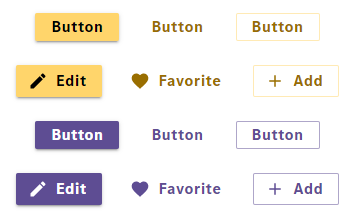
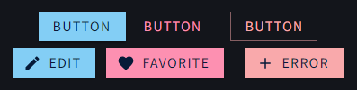
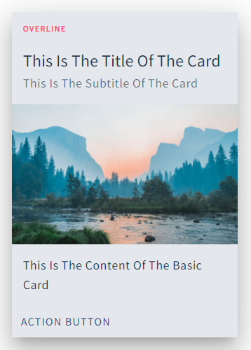
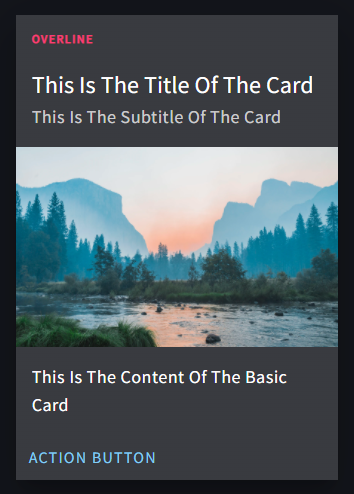

<!-- SPDX-License-Identifier: MIT --->


[](LICENSE)


Product Kit React provides a theme for Daimler TSS web frontends based on the material design framework MUI.

Feel free to open an [issue](https://github.com/mercedes-benz/product-kit_react/issues) or provide a pull request with the desired modifications.

## Examples

<p float="left">
  
   
  
  
</p>

## Installation and Setup

_Note that you must have node (with npm) installed._

Create a new React project and [install MUI](https://mui.com/getting-started/installation/)

```console
npx create-react-app my-app
cd my-app
npm install @mui/material @emotion/react @emotion/styled
```

Install the Product Kit React npm package from the root directory through:

```console
npm install @daimler/productkit-react
```

Product Kit React provides four themes:

- Two themes for creating compact web applications with compact body-max-widths and responsive margins
  - `themeCompactLight` for light mode.
  - `themeCompactDark` for dark mode.
- Two themes with larger body-max-widths, so your application always uses most of the screen, regardless of the screen size. This is often used for web applications like dashboards.
  - `themeWideLight` for light mode.
  - `themeWideDark` for dark mode.

All themes include custom Daimler TSS colors, breakpoints, spacings, shapes and typography.

You can choose between those themes and import the one that suits your use-case best alongside MUI's `ThemeProvider` and `CssBaseline`:

```javascript
//in src/App.js

import { ThemeProvider } from "@mui/material/styles";
import { themeCompactLight } from "@daimler/productkit-react/src/index"; //you may also use the other themes
import CssBaseline from "@mui/material/CssBaseline";
```

Now, add `ThemeProvider` with the imported theme as a wrapper for all your components and add `CssBaseline` as the first component inside of it. You may add the `enableColorScheme` prop to the latter if you wish to use dark mode (see "Usage" section for more information). In order to take advantage of the `compact` and `wide` layout, please wrap your main components in the `main` tag. For example:

```javascript
// in src/App.js

export default function App() {
    return (
        <ThemeProvider theme={themeCompactLight}>
            <CssBaseline enableColorScheme />
            <!-- Navbar, sidebar, etc... -->
            <main>
                <!-- Your main components -->
            </main>
        </ThemeProvider>
    );
}
```

Next, import the fonts `Source Sans Pro` and `Source Code Pro`:

```html
<!-- in head of public/index.html -->

<link
  href="https://fonts.googleapis.com/css2?family=Source+Code+Pro&family=Source+Sans+Pro&display=swap"
  rel="stylesheet"
/>
```

Product Kit React also provides responsive spacings from [Product Kit Core](https://github.com/mercedes-benz/product-kit_core) with `makeStyles`. You can use them by importing the `pkStyles` object in the component and using it inside a component function. More on spacings in the "Usage" section.

```javascript
// in MyComponent.js

import pkStyles from "@daimler/productkit-react/src/styles";

export default function MyComponent() {
    const pkSpacings = pkStyles()
    return (
        <section className={pkSpacings["mt-xxl"]}>
            <!-- this section now has a responsive top-margin of size XXL -->
        </section>
    );
}
```

Advanced: By importing `tokens` and `tokensDark`, you can also use the core variables directly inside of your React app. This could come in handy for example for opacity-values:

```javascript
// in App.js

import { tokens, tokensDark } from "@daimler/productkit-react/src/index";

export default function App() {
    return (
        <IconButton
            color="inherit"
            sx={{ opacity: state ? 1 - tokens.opacityApplicationIconHigh : 1 - tokensDark.opacityApplicationIconContrastHigh }}
        >
            <MenuIcon />
        </IconButton>
    );
}
```


Your MUI components are now styled accordingly to the styleguide of Daimler TSS!

## Usage

### Colors

You can use all custom Daimler TSS colors like `primary` (corporate blue) or `secondary` (corporate pink) as well as other brand colors with their shade like `grayblue-400` and text colors in either of the following ways:

- Using the `color` prop
- Access colors using the `sx` prop
- Calling `useTheme()` to later call the colors in e.g. the `style` prop

```html
<AppBar color='primary'> ... </AppBar>

<Box sx={{ color: 'secondary.main' }}>Text</Box>

<IconButton sx={{ color: 'grayblue-400.main' }}>
    <MenuIcon />
</IconButton>

const theme = useTheme() <!-- Don't forget to import useTheme -->
<div style={{ color: theme.palette.text.secondary }}>Text</Box>
```

The right contrast color is set automatically, but can be called programmatically with for example `pink.contrastText` or `pink-800.contrastText`.

Note that you have to set `color="inherit"` when using icons on colored background in order to receive the correct contrast color.

> All custom colors of Daimler TSS are mentioned in [Product Kit Core](https://github.com/mercedes-benz/product-kit_core).

### Spacing

The standard way of applying spacing in Vuetify is adding for example `sx={{ m: 2 }}` for a margin of `16px` from the `sx` breakpoint on. With Product Kit React, you are now also able to use custom and responsive spacings for `padding` and `margin` by applying t-shirt sizes (`3xs`, `xxs`, `xs`, `s`, `m`, `l`, `xl`, `xxl`, `3xl`) instead of absolute numbers. The spacing will now be responsive regarding the width of the screen. Please refer to the "Installation & Setup" section for more information on how to setup.

When using `MuiGrids`

> For further information on MUI spacings visit the [MUI Spacing Documentation](https://mui.com/system/spacing/). Information on responsive spacings with t-shirt sizes can be found in [Product Kit Core](https://github.com/mercedes-benz/product-kit_core)

### Container

You should use the `main`-tag alongside `CssBaseline` and either of the custom Daimler TSS themes to wrap all your main components in order to get responsive margins and max-widths. Please refer to the "Installation & Setup" section for more information and a code example on this.

### Typography

You can use typography as you are used to from MUI. Custom Daimler TSS responsive tokens are applied automatically.

```html
<Typography variant="h6"> I'm a headline 6 and I'm responsive! </Typography>
```

### Darkmode

You can initially use one of the two dark themes (`themeCompactDark` and `themeWideDark`) or switch the theme during runtime. One example of how to accomplish this using `React Hooks`:

```javascript
// in src/App.js
// don't forget to import the necessary packages and fucntions

export default function App() {
    const [state, setState] = React.useState(true);
    const classes = useStyles();
    const switchDarkMode = () => {
        setState(!state)
    }
    return (
        <ThemeProvider theme={state ? themeCompactLight : themeCompactDark}>
            <CssBaseline enableColorScheme />
            <Navbar>
                <FormGroup>
                    <FormControlLabel control={<Switch color="secondary" onChange={switchDarkMode}/>} label="Darkmode" />
                </FormGroup>
            </Navbar>
            <main>
                <!-- Your main components -->
            </main>
        </ThemeProvider>
    );
}
```


The Daimler TSS application colors like `primary` are also automatically changed when switching to dark mode (see examples).

### Elevation

You can use the `elevation` prop to apply elevation to supported MUI components. In dark mode, the elevation will also change the surface (`paper`) color automatically: Higher elevation, lighter surface, as described in the [Material Design documentation](https://material.io/design/color/dark-theme.html#properties).

## Contributing

We welcome any contributions.
If you want to contribute to this project, please read the [contributing guide](CONTRIBUTING.md).

## Code of Conduct

Please read our [Code of Conduct](https://github.com/Daimler/daimler-foss/blob/master/CODE_OF_CONDUCT.md) as it is our base for interaction.

## License

This project is licensed under the [MIT LICENSE](LICENSE).

## Provider Information

Please visit <https://www.daimler-tss.com/en/imprint/> for information on the provider.

Notice: Before you use the program in productive use, please take all necessary precautions,
e.g. testing and verifying the program with regard to your specific use.
The program was tested solely for our own use cases, which might differ from yours.
