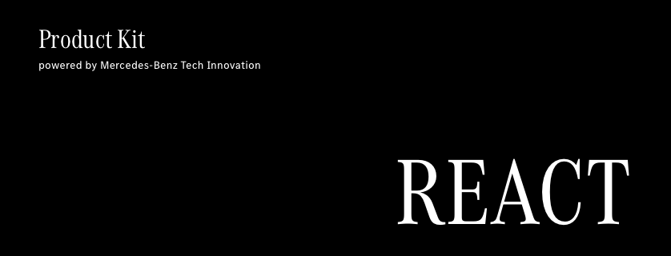

<!-- SPDX-License-Identifier: MIT --->

Product Kit React provides a theme for Daimler TSS web frontends based on the material design framework MUI.

Feel free to open an [issue](https://github.com/mercedes-benz/product-kit_react/issues) or provide a pull request with the desired modifications.

## Examples
⚠️ //TODO//

## Installation
⚠️ //TODO//

## Usage
⚠️ //TODO//

### Colors

### Spacing

### Container

### Typography

### Darkmode

### Elevation

## Contributing

We welcome any contributions.
If you want to contribute to this project, please read the [contributing guide](CONTRIBUTING.md).

## Code of Conduct

Please read our [Code of Conduct](https://github.com/Daimler/daimler-foss/blob/master/CODE_OF_CONDUCT.md) as it is our base for interaction.

## License

This project is licensed under the [MIT LICENSE](LICENSE).

## Provider Information

Please visit <https://www.daimler-tss.com/en/imprint/> for information on the provider.

Notice: Before you use the program in productive use, please take all necessary precautions,
e.g. testing and verifying the program with regard to your specific use.
The program was tested solely for our own use cases, which might differ from yours.
